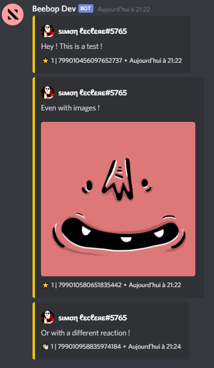

# Discord Starboards

Discord Starboards is a powerful [Node.js](https://nodejs.org) module that allows you to easily create Starboards !

If you have an idea or a problem, don't hesitate to open an issue :)

## Features

- ⏱️ Easy to use! Create and delete your starboards and the module takes care of the rest!
- 🔄 Automatic restart after bot crash!
- 📁 Support for all databases! (default is json)
- 🌐 Support for multiple starboards per server, and even per channels with a different emoji and different options!
- ⚙️ Very customizable! (emoji, threshold, selfstat, botStars, ect...)
- 💥 Support for all languages using events !
- 💪🏻 Parse images url and even tenor gifs url !

## Description

A starboard is a channel gathering the best messages from a server.
To make a message appear in the starboard, just react to it with a star ⭐ !
The star counter of the last 100 messages is updated with each reaction.

Example : A message generated by this package



## Installation

```js
npm install discord-starboards
```

## Documentation

To quickly understand how to use the module, you can read [Getting Started](/docs/gettingStarted.md).

For a more advanced use :

- [Custom Database](/docs/customDatabase.md)
- [Events](/docs/events.md)
- [Advanced usage](/docs/advanced.md)
