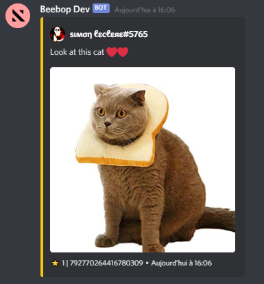

# Discord Starboards

Discord Starboards is a powerful [Node.js](https://nodejs.org) module that allows you to easily create Starboards !

## Features

-   ⏱️ Easy to use! Create and delete your starboards and the module takes care of the rest!
-   🔄 Automatic restart after bot crash!
-   📁 Support for all databases! (default is json)
-   🌐 Support for multiple starboards per server, and even per channels with a different emoji and different options!
-   ⚙️ Very customizable! (emoji, threshold, selfstat, botStars, etc...)
-   💥 Events: starboardCreate, starboardDelete, starboardReactionAdd, starboardReactionRemove, starboardReactionRemoveAll, starboardReactionNsfw, starboardNoSelfStar, starboardNoStarBot, starboardAlreadyStarred, starboardNoEmptyMsg

## Description

A starboard is a channel gathering the best messages from a server.
To make a message appear in the starboard, just react to it with a star ⭐ !
The star counter of the last 100 messages is updated with each reaction.

Example : A message generated by this package



## Installation

```js
npm install discord-starboards
```

## Examples

### Launch of the module

```js
const Discord = require('discord.js');
const client = new Discord.Client();

// Requires Manager from discord-starboards
const StarboardsManager = require('discord-starboards');

// Initialise it
const manager = new StarboardsManager(client, {
    storage: './starboards.json',
});

// We now have a starboardsManager property to access the manager everywhere!
client.starboardsManager = manager;

client.on('ready', () => {
    console.log("I'm ready !");
});

client.login('SUP3R_S3CR3T_T0K3N');
```

Parameters: 
-   **client**: the discord client (your discord bot instance)
-   **options.storage**: A file path to choose where to store the starboards (or false if you use your own database)

After that, the module will automatically retrieve already existing starboards and start waiting for reactions.

### Create a starboard

```js
client.on('message', (message) => {
    const args = message.content.slice(settings.prefix.length).trim().split(/ +/g);
    const command = args.shift().toLowerCase();

    if (command === 'create-starboard') {
        client.starboardsManager.create(message.channel);
        message.channel.send(`The ${message.channel} channel is now a starboard!`);
    }
});
```

-   **options.emoji**: The emoji to react with in order to get the message into the starboard. If it's a custom emoji, it must be formatted as <:name:id>. The default emoji is `⭐`.
-   **options.starBotMsg**: Whether or not the messages from bots can be starred. Default value is true.
-   **options.selfStar**: Whether users can star their own messages or not. Default value is true.
-   **options.starEmbed**: Whether users can star embeds or not. The default value is true.
-   **options.attachments**: Whether images can be starred or not. Default value is true.
-   **resolveImageUrl**: Whether image links are displayed as an image or as a link. The default value is true.
-   **options.threshold**: The number of reactions it takes before a message enters the starboard. By default it is 0.
-   **options.color**: A string representing the color of the embed. The default value is `#f1c40f` (Yellow).
-   **options.allowNsfw**: Whether messages in an nsfw channel can be starred or not. The default value is false.


### Fetch starboards

```js
// The list of all the starboards
let allStarboards = client.starboardsManager.starboards; // returns an array of starboards

// The list of all the starboards on the server with ID "710219907890937856"
let onServer = client.starboardsManager.starboards.filter((s) => s.guildID === '710219907890937856');

// There can't be two starboards with the same emoji on the same server.
let starboard = client.starboardsManager.starboards.find(s => s.guildID === message.guild.id && s.options.emoji === '⭐');
```

### Delete a starboard

```js
client.on('message', (message) => {
    const args = message.content.slice(settings.prefix.length).trim().split(/ +/g);
    const command = args.shift().toLowerCase();

    if (command === 'delete') {
        client.starboardsManager.delete(message.channel.id, '⭐');
        message.channel.send(`The ${message.channel} channel is no longer a starboard!`);
    }
});
```

When you use the delete function, the starboard data is deleted from the database.

### Get the leaderboard of a server

The `Starboard` class has a `leaderboard()` method which allows to return an array containing the 10 most starred messages of a starboard among the last 100 of the channel. The returned messages have a new `stars` property which contains the number of stars in the message.

```js
client.on('message', (message) => {
    const args = message.content.slice(settings.prefix.length).trim().split(/ +/g);
    const command = args.shift().toLowerCase();

    if (command === 'leaderboard') {
        const starboard = manager.starboards.find(s => s.guildID === message.guild.id && s.options.emoji === '⭐')
        if(!starboard) return message.channel.send('No starboard found.');

        const lb = await starboard.leaderboard();
        const content = lb.map((m, i) => `**${i+1}.**     ${m.stars} ⭐  -  ${m.embeds[0].description || `[Image](${m.embeds[0].image.url})`}`);

        const leaderboard = new Discord.MessageEmbed()
            .setTitle(`${message.guild.name}'s starboard`)
            .setDescription(content.join('\n'))
        message.channel.send(leaderboard);
    }
})
```

The leaderboard function takes an optional argument which allows you to choose how many messages it will return.

## Custom database

You can use your custom database to save starboards, instead of the json files (the "database" by default for discord-starboards). For this, you will need to extend the `StarboardsManager` class, and replace some methods with your custom ones. There are 4 methods you will need to replace:

-   `getAllStarboards`: this method returns an array of stored starboards.
-   `saveStarboard`: this method stores a new starboard in the database.
-   `deleteStarboard`: this method deletes a starboard already stored in the database.

**All the methods should be asynchronous to return a promise.**

Here is an example, using quick.db, a Sqlite database. The comments in the code below are very important to understand how it works!

```js
const Discord = require('discord.js');
const client = new Discord.Client();

// Load quick.db - it's an example of custom database, you can use MySQL, PostgreSQL, etc...
const db = require('quick.db');
if (!db.get('starboards')) db.set('starboards', []);

const StarboardsManager = require('discord-starboards');
const StarboardsManagerCustomDb = class extends StarboardsManager {
    // This function is called when the manager needs to get all the starboards stored in the database.
    async getAllStarboards() {
        // Get all the starboards in the database
        return db.get('starboards');
    }

    // This function is called when a starboard needs to be saved in the database (when a starboard is created or when a starboard is edited).
    async saveStarboard(data) {
        // Add the new one
        db.push('starboards', data);
        // Don't forget to return something!
        return true;
    }


    // This function is called when a starboard needs to be deleted from the database.
    async deleteStarboard(channelID, emoji) {
        // Remove the starboard from the array
        const newStarboardsArray = db.get('starboards').filter((starboard) => !(starboard.channelID === channelID && starboard.options.emoji === emoji));
        // Save the updated array
        db.set('starboards', newStarboardsArray);
        // Don't forget to return something!
        return true;
    }
};

// Create a new instance of your new class
const manager = new StarboardsManagerCustomDb(client, {
    storage: false, // Important - use false instead of a storage path
});
// We now have a starboardsManager property to access the manager everywhere!
client.starboardsManager = manager;

client.on('ready', () => {
    console.log("I'm ready !");
});

client.login('SUP3R_S3CR3T_T0K3N');
```

## Events

Events are powerful tools to add conditions for a message to enter the starboard, to send custom messages when a user encounters an error, ...

```js
/**
 * Emitted when a starboard is created
 * @event StarboardsManager#starboardCreate
 * @param {object} data The channel data
 *
 * @example
 * // This can be used to add features such as a log message
 * manager.on('starboardCreate', (data) => {
 *     console.log(`New starboard ! ChannelID: ${data.channelID}`);
 * });
 */
```
```js
/**
 * Emitted when a starboard is deleted
 * @event StarboardsManager#starboardDelete
 * @param {object} data The channel data
 *
 * @example
 * // This can be used to add features such as a log message
 * manager.on('starboardDelete', (data) => {
 *     console.log(`Starboard deleted ! ChannelID: ${data.channelID}`);
 * });
 */
```
```js
/**
 * Emitted when a new reaction for a starboard is received, whether the message is cached or not.
 * @event StarboardsManager#starboardReactionAdd
 * @param {string} emoji The emoji
 * @param {Discord.Message} message The message
 * @param {Discord.User} user The user who reacted
 * @example
 * // This can be used to add features such as a an additional filter so that only certain roles have access to the starboard
 * manager.on('starboardReactionAdd', (emoji, message, user) => {
 *      console.log(`${user.username} reacted to a message with ${emoji}.`)
 * });
 */
```
```js
/**
 * Emitted when a reaction for a starboard is removed, whether the message is cached or not.
 * @event StarboardsManager#starboardReactionRemove
 * @param {string} emoji The emoji
 * @param {Discord.Message} message The message
 * @param {Discord.User} user The user who reacted
 * @example
 * manager.on('starboardReactionRemove', (emoji, message, user) => {
 *      console.log(`${user.username} remove his reaction to a message.`)
 * });
 */
```
```js
/**
 * Emitted when all reactions to a starboard message are removed, whether the message is cached or not.
 * @event StarboardsManager#starboardReactionRemoveAll
 * @param {Discord.Message} message The message
 * @example
 * manager.on('starboardReactionAdd', (message) => {
 *      console.log(`Message ${message.id} purged.`)
 * });
 */
```
```js
/**
 * Emitted when a user reacts to a message in a nsfw channel and the `allowNsfw` option is disabled.
 * @event StarboardsManager#starboardReactionNsfw
 * @param {string} emoji The emoji
 * @param {Discord.Message} message The message
 * @param {Discord.User} user The user who reacted
 * @example
 * manager.on('starboardReactionNsfw', (emoji, message, user) => {
 *      message.channel.send(`${user.username}, you cannot add messages from an nsfw channel to the starboard.`)
 * });
 */
```
```js
/**
 * Emitted when a user reacts to his own message and the `selfStar` option is disabled.
 * @event StarboardsManager#starboardNoSelfStar
 * @param {string} emoji The emoji
 * @param {Discord.Message} message The message
 * @param {Discord.User} user The user who reacted
 * @example
 * manager.on('starboardNoSelfStar', (emoji, message, user) => {
 *      message.channel.send(`${user.username}, you cannot star your own messages.`)
 * });
 */
```
```js
/**
 * Emitted when a user reacts to a bot message and the `starBot` option is disabled.
 * @event StarboardsManager#starboardNoStarBot
 * @param {string} emoji The emoji
 * @param {Discord.Message} message The message
 * @param {Discord.User} user The user who reacted
 * @example
 * manager.on('starboardNoStarBot', (emoji, message, user) => {
 *      message.channel.send(`${user.username}, you cannot star bot messages.`)
 * });
 */
```
```js
/**
 * Emitted when a user reacts to a message that is already in the starboard and the `starStar` option is disabled.
 * @event StarboardsManager#starboardAlreadyStarred
 * @param {string} emoji The emoji
 * @param {Discord.Message} message The message
 * @param {Discord.User} user The user who reacted
 * @example
 * manager.on('starboardAlreadyStarred', (emoji, message, user) => {
 *      message.channel.send(`${user.username}, this message is already in the starboard.`)
 * });
 */
```
```js
/**
 * Emitted when a user reacts to a message without exploitable content for the starboard
 * @event StarboardsManager#starboardNoEmptyMsg
 * @param {string} emoji The emoji
 * @param {Discord.Message} message The message
 * @param {Discord.User} user The user who reacted
 * @example
 * manager.on('starboardNoEmptyMsg', (emoji, message, user) => {
 *      message.channel.send(`${user.username}, you cannot star an empty message.`)
 * });
 */
```